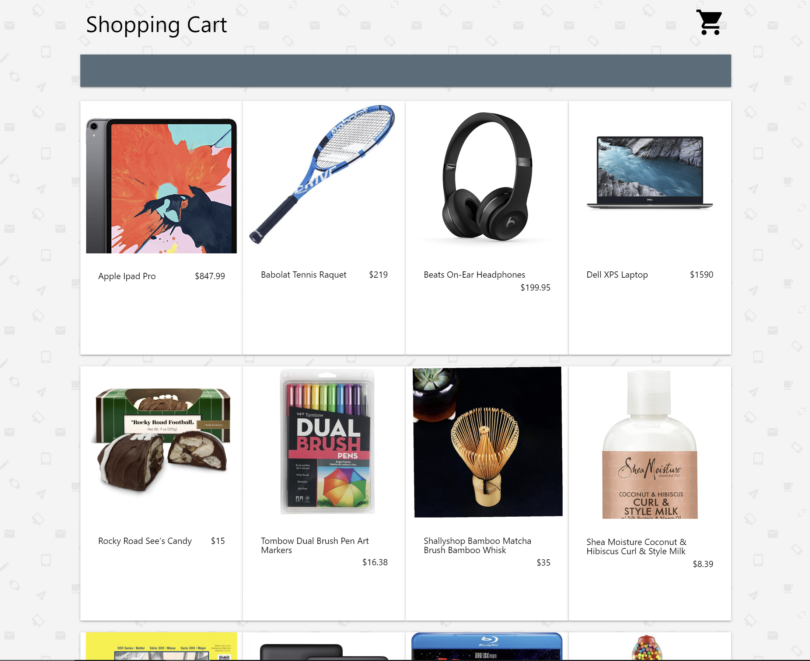
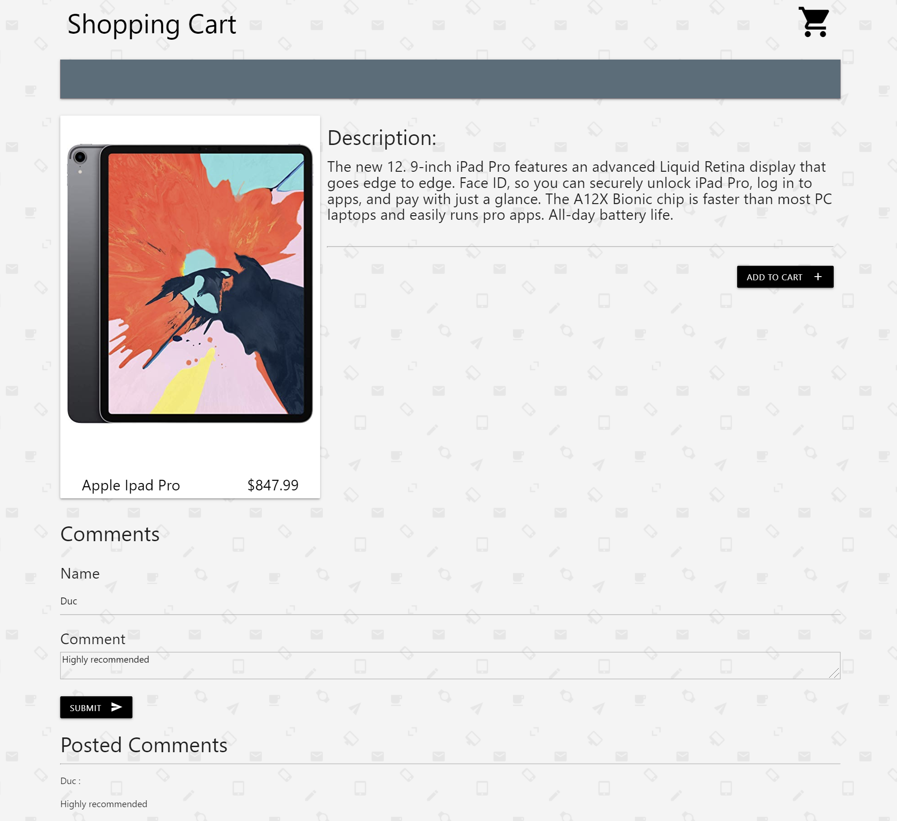
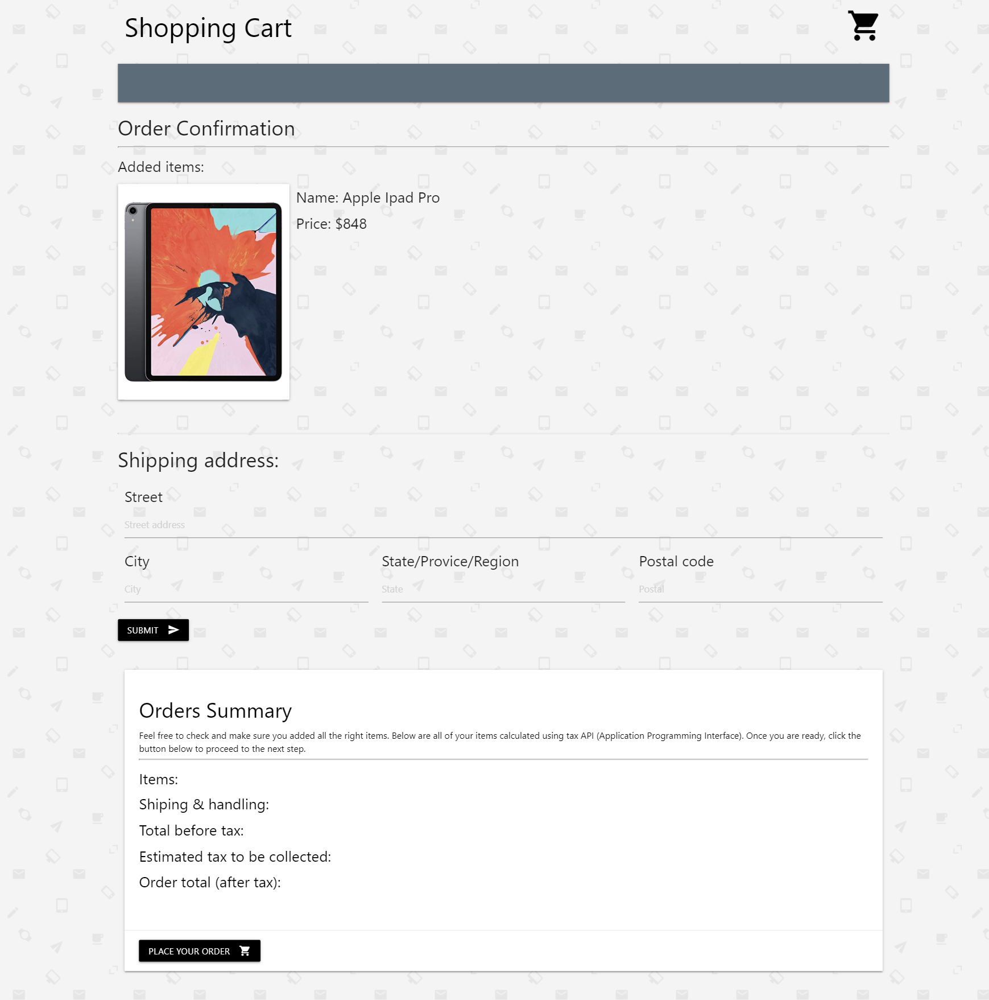

# Shopping Reviews

#### User's Story

AS an online customer, I WANT to checkout the items. SO THAT I can buy the right item.

#### Purpose

* Home page: this page allow users to check out different items, the name and also the pricing
* Description page: this page allow users to read specifics about each items, and they can also add the item to carts to that they can see the total amount they have to pay with tax included if they were to purchase all the items they chose. Also users can add comments about certain items they like, and they can see all the posted comments before they added to the cart.
* Order confirmation page: this page allow users to see all they added items and if they click on the items it will take them back to the item description page where they can see the specifics on the items and also add or checkout the posted comment section. Also they can add their information and see their order summary including number of items ordered, tax values, and total amount with tax included. "Place your order" button will direct them to credit card payment information which will be for future development.

#### Functionality

The functionality of this project includes:
* the use of MySQL database, 
* the use of Sequelize
* GET and POST routes for retrieving and adding new data
* Third-party API
* Polished website using JS, CSS framework (Materialize)
* MVC structured 
* Handlebars
* Eslint styles for coding standards
* Deployment to Heroku

#### Future Development

* Search bar or Select dropdown
* Account managements system:
    * New users sign up option
    * Registered users
* Confirmation Page: 
    * Add UI options to change quantity and delete certain items
* Saved shipping address after user clicked "Submit"
* Credit card information page
* Item Description page:
    * Add rating reviews

#### Home Page Image

#### Item Description Page Image

#### Confirmation Page Image

#### Link to github page: 
https://github.com/llkaplan/project-2

